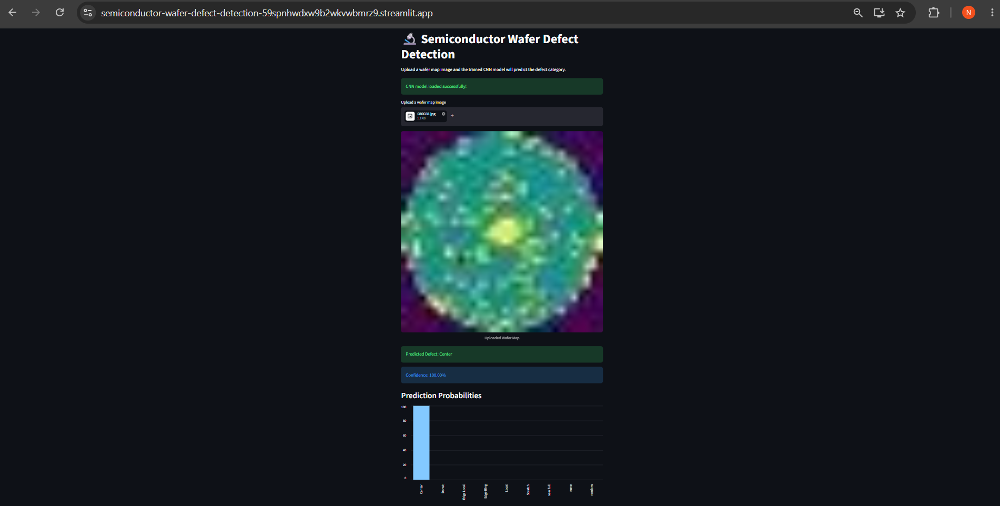

# Semiconductor Wafer Defect Detection

A CNN-based computer vision project for classifying semiconductor wafer map defects into 9 categories.

## 🚀 Live Demo

Streamlit App:
https://semiconductor-wafer-defect-detection-59spnhwdxw9b2wkvwbmrz9.streamlit.app/

## ✨ Features

- CNN-based wafer defect classification
- 9 defect categories
- Image preprocessing and normalization
- 128 × 128 image input
- Interactive Streamlit application
- Real-time image upload and prediction
- Prediction confidence and class probabilities

## 🔬 Defect Classes

The model classifies wafer maps into 9 defect categories:

1. Center
2. Donut
3. Edge Local
4. Edge Ring
5. Local
6. Scratch
7. Near Full
8. None
9. Random

## 📊 Dataset

The project uses the WM811K wafer map dataset for training and evaluation.

## 🧠 CNN Methodology

```text
Wafer Map Image
       ↓
Image Preprocessing
       ↓
Resize to 128 × 128
       ↓
Pixel Normalization
       ↓
CNN Feature Extraction
       ↓
Classification Layer
       ↓
9 Defect Classes
       ↓
Prediction + Confidence
## 📈 Model Evaluation & Results

The trained CNN model was evaluated on a test set containing 902 wafer map images.

### Performance

| Metric | Score |
|---|---:|
| Test Accuracy | **91.57%** |
| Test Loss | **0.3499** |
| Macro F1-score | **0.91** |
| Weighted F1-score | **0.91** |

### Class-wise Performance

| Defect Class | Precision | Recall | F1-score |
|---|---:|---:|---:|
| Center | 0.90 | 0.98 | 0.94 |
| Donut | 0.95 | 0.94 | 0.95 |
| Edge Local | 0.87 | 0.90 | 0.89 |
| Edge Ring | 0.88 | 0.98 | 0.93 |
| Local | 0.95 | 0.76 | 0.84 |
| Scratch | 0.88 | 0.85 | 0.86 |
| Near Full | 0.96 | 1.00 | 0.98 |
| None | 0.97 | 0.87 | 0.92 |
| Random | 0.91 | 0.96 | 0.93 |

The model achieved **91.57% test accuracy** across the 902-image test set.

> Note: Prediction confidence for an individual image is different from overall test accuracy.


## 📸 Demo
## 🛠️ Installation

Clone the repository and install the required dependencies:

```bash
git clone https://github.com/nikh0011/Semiconductor-Wafer-Defect-Detection.git
cd Semiconductor-Wafer-Defect-Detection
pip install -r requirements.txt
### Streamlit Prediction


